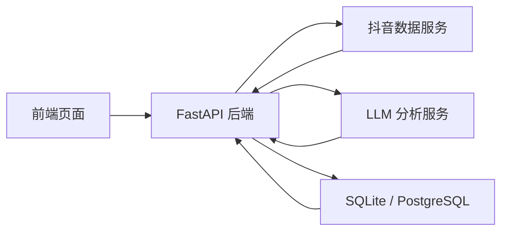
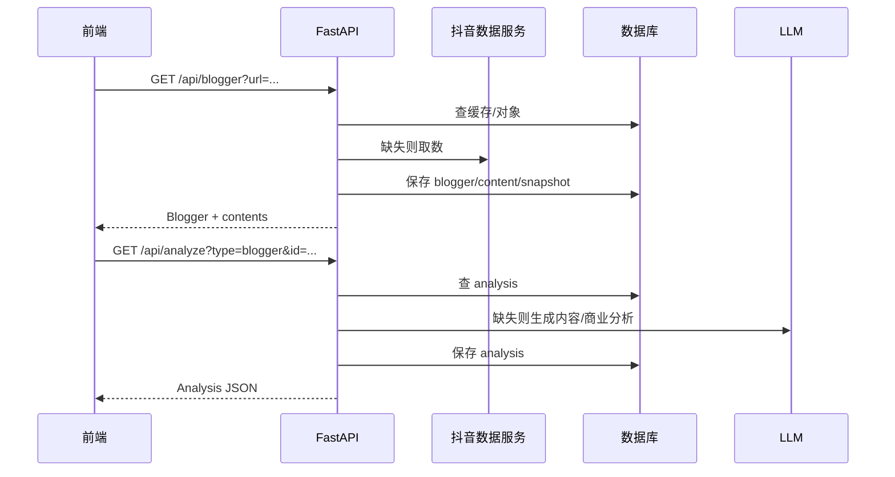
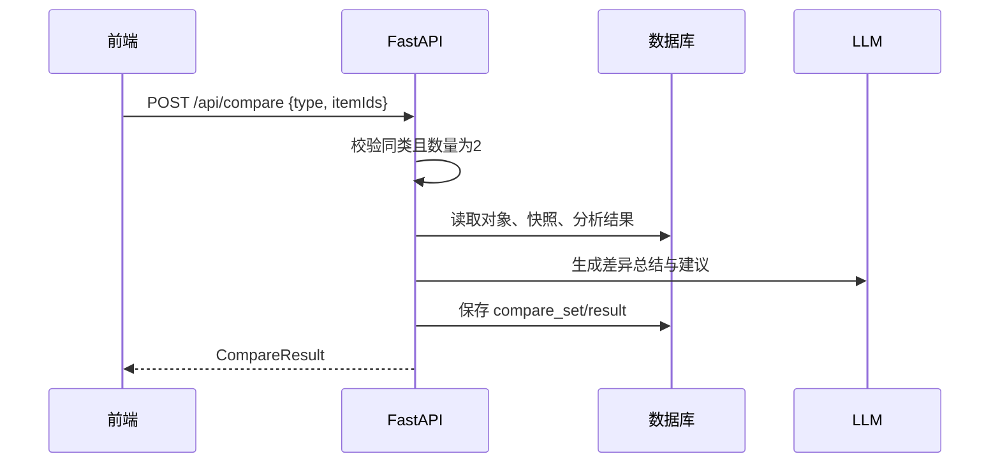

# 自媒体工作台Agent 后端与数据库技术方案

> 依据现有 PRD/前端设计/全栈方案整理。当前仓库已有 `backend/` FastAPI 骨架，但没有独立数据库目录与 schema；本方案用于把后端、数据模型、数据库落表和后续迭代边界对齐。

## 1. 当前状态

| 模块 | 当前是否已有 | 位置 | 说明 |
|---|---:|---|---|
| 前端静态站点 | 是 | 根目录 `index.html` / `discover.html` / `compare.html` | 纯 HTML + CSS + ES Module |
| 前端 mock 数据 | 是 | `assets/mock/` | 支撑无后端演示 |
| 后端目录 | 是 | `backend/` | FastAPI 骨架，含取数、归一化、分析、缓存、对比模块 |
| 数据库目录 | 否，现已补 | `database/` | 本次新增 schema 初稿 |
| 技术方案目录 | 否，现已补 | `docs/` | 本次新增后端与数据库方案 |
| 现有缓存库 | 运行时生成 | `backend/cache.db` | `cache.py` 会自动创建轻量 `kv`、`saved` 表 |

当前后端是 MVP 骨架：能启动 API、托管前端、在未配置抖音取数/LLM 时回退 mock。下一步若要做真实产品，需要把 `cache.py` 的临时 KV 缓存升级为结构化数据库。

## 2. 后端职责

后端不重复造爬虫，核心是编排：



后端主要负责：

| 职责 | 说明 |
|---|---|
| 数据取数 | 调用 Douyin_TikTok_Download_API 或后续采集服务 |
| 数据归一化 | 把原始抓取 JSON 转成 Blogger / Content / MetricSnapshot |
| 数据分析 | 计算浏览、点赞、收藏、粉丝、极值、均值、差异 |
| AI 分析 | 组织 prompt，调用 LLM，校验结构化 JSON |
| 对比分析 | 限定同类对象，对比数据/内容/商业维度并输出建议 |
| 缓存与持久化 | 保存对象、快照、分析结果、对比方案、用户保存项 |
| 降级兜底 | 外部服务失败时返回 mock 或缓存结果，不让页面白屏 |

## 3. 推荐后端模块结构

现有 `backend/` 基本合理，建议后续演进为：

```text
backend/
├── main.py                 FastAPI 入口、路由挂载、静态文件托管
├── settings.py             环境变量、数据库 URL、第三方服务配置
├── db.py                   数据库连接、事务、迁移入口
├── models.py               领域模型 / Pydantic schemas
├── repositories/           数据读写层
│   ├── bloggers.py
│   ├── contents.py
│   ├── analyses.py
│   ├── compares.py
│   └── saved.py
├── services/               业务编排层
│   ├── douyin_service.py
│   ├── analysis_service.py
│   ├── compare_service.py
│   └── discover_service.py
├── douyin_client.py         抖音数据服务 HTTP client
├── normalize.py             原始 JSON 到统一模型
├── metrics.py               指标计算
├── analyzer.py              内容/商业分析编排
├── compare.py               对比结果生成
├── llm.py                   LLM client
├── cache.py                 MVP 轻量缓存，后续逐步下线
└── prompts/
```

MVP 阶段可以继续保留扁平结构；接真实数据和保存列表时，再拆 `repositories/` 与 `services/`。

## 4. API 设计

### 4.1 基础接口

| 方法 | 路径 | 用途 | 当前状态 |
|---|---|---|---|
| GET | `/api/health` | 服务健康检查、mock/live 模式 | 已有 |
| GET | `/api/categories` | 内容垂类词表 | 已有 |
| GET | `/api/bloggers` | 博主列表 | 已有 |
| GET | `/api/blogger?url=` | 获取单个博主主页与作品 | 已有 |
| GET | `/api/content?url=` | 获取单条内容 | 已有 |
| GET | `/api/analyze?type=&id=` | 分析博主或内容 | 已有 |
| GET | `/api/discover/rank` | 榜单 | 已有，当前 mock |
| POST | `/api/compare` | 对比两个对象 | 已有，当前示例逻辑 |
| POST | `/api/saved` | 保存结果 | 已有，当前轻量保存 |

### 4.2 建议新增接口

| 方法 | 路径 | 用途 |
|---|---|---|
| GET | `/api/saved` | 获取已保存列表 |
| DELETE | `/api/saved/{id}` | 删除保存项 |
| POST | `/api/fetch-jobs` | 创建抓取任务 |
| GET | `/api/fetch-jobs/{id}` | 查询抓取进度 |
| POST | `/api/analyze/stream` | SSE 流式分析 |
| POST | `/api/compare/stream` | SSE 流式对比 |

## 5. 核心领域模型

```text
Blogger
  id, platform, platform_user_id, name, avatar, fans, domain, tags, bio, verified

Content
  id, blogger_id, platform_content_id, title, type, cover, url, published_at

MetricSnapshot
  target_type, target_id, metric_date, fans, view_count, like_count, collect_count, comment_count, share_count

Analysis
  target_type, target_id, analysis_type, status, result_json, confidence, generated_at

CompareSet
  compare_type, status, result_json, created_at

CompareItem
  compare_set_id, target_type, target_id, role, sort_order

SavedItem
  item_type, ref_type, ref_id, payload_json, created_at
```

对象分类规则：

| 分类 | `target_type` | 说明 |
|---|---|---|
| 博主 | `blogger` | 账号、人设、粉丝、商业信号维度 |
| 内容 | `content` | 单条视频/图文、播放点赞收藏维度 |

对比约束：

- 同一次对比只能选择同一类对象。
- 最多选择 2 个对象。
- `compare_type = blogger` 时，`compare_items.target_type` 必须都是 `blogger`。
- `compare_type = content` 时，`compare_items.target_type` 必须都是 `content`。

## 6. 数据库选型

### 6.1 MVP

使用 SQLite：

- 零运维，适合本机和轻量部署。
- 与当前 `backend/cache.py` 一致。
- 先把数据结构跑通，避免过早引入数据库服务。

### 6.2 产品化

升级 PostgreSQL：

- 支持并发写入和复杂查询。
- JSONB 可保留原始抓取结果与 LLM 输出。
- 适合后续做多用户、历史快照、趋势聚合。

迁移策略：

1. 当前 `kv/saved` 继续兼容。
2. 新增结构化表写入。
3. API 读结构化表，缺失时读旧缓存。
4. 稳定后下线临时 KV。

## 7. 表结构说明

本次新增 `database/schema.sql`，覆盖以下表：

| 表 | 用途 |
|---|---|
| `bloggers` | 博主主表 |
| `contents` | 内容主表 |
| `metric_snapshots` | 指标历史快照 |
| `analyses` | 数据/内容/商业分析结果 |
| `compare_sets` | 一次对比任务 |
| `compare_items` | 对比任务中的两个对象 |
| `saved_items` | 用户保存的分析/方案 |
| `fetch_jobs` | 异步抓取任务 |
| `api_cache` | 外部 API 与 LLM 缓存 |

这些表不要求一次性全部接入。优先顺序：

1. `bloggers`、`contents`
2. `metric_snapshots`
3. `analyses`
4. `compare_sets`、`compare_items`
5. `saved_items`
6. `fetch_jobs`、`api_cache`

## 8. 数据流

### 8.1 爆款拆解



### 8.2 对比分析



## 9. 环境变量

| 变量 | 示例 | 说明 |
|---|---|---|
| `APP_ENV` | `local` | 运行环境 |
| `DATABASE_URL` | `sqlite:///./backend/cache.db` | 数据库地址 |
| `DOUYIN_API_BASE` | `http://localhost:80` | 抖音数据服务 |
| `LLM_API_KEY` | `sk-xxx` | LLM 密钥 |
| `LLM_BASE_URL` | `https://api.deepseek.com` | LLM 兼容接口 |
| `LLM_MODEL` | `deepseek-chat` | 模型名 |
| `CACHE_TTL_SECONDS` | `86400` | 外部数据缓存时间 |

## 10. 实施路线

### Phase 1：结构化存储

- 新增 `db.py`，启动时执行 `database/schema.sql`。
- 把 `backend/cache.py` 的 `saved` 写入迁到 `saved_items`。
- 把 `blogger/content` 结果写入结构化表。

### Phase 2：真实数据接入

- 部署 Douyin_TikTok_Download_API。
- 在 `douyin_client.py` 接真实接口。
- `normalize.py` 完成真实字段映射。
- 写入 `metric_snapshots`，支持历史数据。

### Phase 3：AI 分析生产化

- 分析结果落 `analyses`。
- 增加重试、状态、失败原因。
- 支持 `/api/analyze/stream`。

### Phase 4：对比与保存列表

- `POST /api/compare` 写 `compare_sets`、`compare_items`。
- `GET /api/saved` 做真实已保存列表。
- 前端「已保存」从 alert 改为列表页或弹窗。

### Phase 5：可部署与可维护

- PostgreSQL 兼容。
- 数据迁移脚本。
- 抓取任务队列与限流。
- 基础日志、监控、错误追踪。

## 11. 风险与边界

| 风险 | 处理 |
|---|---|
| 抖音风控导致取数失败 | 缓存兜底、错误提示、降低频率 |
| LLM 输出不稳定 | JSON schema 校验、失败重试、保留 confidence |
| 商业变现推测误伤事实 | 前端强制标注“推测/依据不足” |
| 个人账号数据合规 | 需要用户授权，不抓取未授权隐私数据 |
| GitHub Pages 只支持静态站 | 后端需单独部署，前端 `API_BASE` 指向后端 |

## 12. 结论

仓库目前已经有后端骨架，但数据库还只是临时 `cache.py` 自动建表。下一步建议按本方案补 `db.py + database/schema.sql` 的结构化存储，先不用上 PostgreSQL，SQLite 足够把真实抓取、分析保存、对比结果这条链路跑通。
